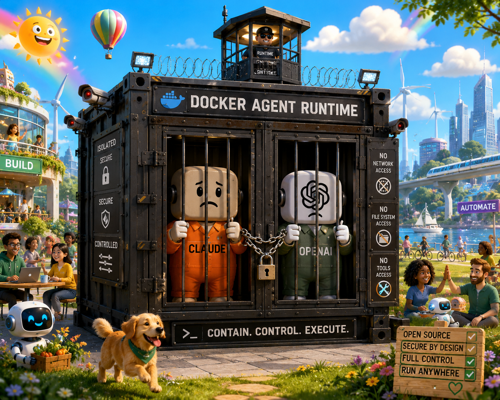

# Docker Agent Runtime

<p align="center">
  
</p>

A sandboxed Docker image that runs **Claude Code** and **Codex CLI** side-by-side, tuned for Laravel / Node / Playwright stacks (auto-detects Laravel projects and brings up postgres + redis on loopback). Network egress is restricted to a curated allowlist; no host secrets are bind-mounted; named volumes keep agent logins, npm/composer caches, and Playwright browsers around between rebuilds.

## Prerequisites

- Docker Desktop (macOS/Windows) or Docker Engine 24+ (Linux), **running** — not just installed. Smoke-test with `docker info`; if it hangs or errors, start Docker Desktop before continuing. Otherwise `docker build` and `docker run` will block silently waiting for an absent daemon.
- ~8 GB free disk for the image and Playwright browsers.
- (Optional) An `ANTHROPIC_API_KEY` and/or `OPENAI_API_KEY` exported in your shell. You can skip these and use interactive `claude login` / `codex login` instead — credentials persist in named volumes.
- (Optional, macOS) An SSH agent on the host (`ssh-add -l` should not error). Docker Desktop on macOS does not natively forward `SSH_AUTH_SOCK` from the host, so `run.sh` mounts it explicitly. If git-over-ssh fails inside the container, see *Known limitations* below.

## Quick start

There are three supported entry points. Pick whichever matches your workflow.

### 1. VSCode / Cursor devcontainer

```bash
# Open the project in VSCode / Cursor, then:
#   Cmd-Shift-P → "Dev Containers: Reopen in Container"
```

The devcontainer picks up `ANTHROPIC_API_KEY` / `OPENAI_API_KEY` from your local shell environment via `${localEnv:...}` substitution. It also bind-mounts `~/.gitconfig` read-only so commits keep your name/email.

### 2. Docker Compose

```bash
cd docker-agent-runtime
docker compose up -d
docker compose exec agent zsh

# Optional Postgres + Redis sidecars on a private network:
docker compose --profile laravel up -d
```

### 3. One-shot launcher

```bash
cd docker-agent-runtime
./run.sh                                       # mount $PWD at /workspace
./run.sh /path/to/other/repo                   # mount that repo instead
./run.sh --no-sidecars /path/to/repo           # skip auto-started sidecars
./run.sh --with-postgres /path/to/repo         # force postgres on for non-Laravel
./run.sh --with-laravel  /path/to/repo         # force both sidecars on
./run.sh --resume /path/to/repo                # import host Claude/Codex sessions
./run.sh --no-worktree-prompt                  # skip the issue/worktree prompt
./run.sh --help                                # full flag list
```

**Worktree prompt on bare invocation.** When you run `./run.sh` (or `agent`) with **no project path** from inside a git repo, the launcher first asks `Create a new worktree for an issue? [y/N]`. Pick `y` and it opens an arrow-key selector with `[create new branch]` plus all remote branches from `origin`. Selecting an existing branch checks it out into `./.worktrees/<branch>` and mounts that worktree at `/workspace`. Selecting `[create new branch]` opens an issue selector from `gh issue list`; picking an issue creates a branch like `42-fix-login-redirect`, while `[Enter custom branch name]` lets you type the branch manually. When the container shell exits, the launcher asks whether to remove that same worktree; dirty worktrees require a second confirmation before `git worktree remove --force` is used. Add `.worktrees/` to `.gitignore`. Skip the startup prompt with `--no-worktree-prompt` or `WORKTREE_PROMPT=0`. Passing an explicit project path also bypasses both the startup and cleanup prompts.

On first invocation `run.sh` tries `docker pull ghcr.io/timniemeier/agent-runtime:latest` (~30 sec on a normal connection) and falls back to a local `docker build` (~3 min on M1) only if the pull fails or `AGENT_FORCE_BUILD=1` is set. The pulled image is re-tagged as `agent-runtime:latest` so subsequent launches reuse it. Container names are a hash of the project path (so different repos don't collide), the SSH agent socket is forwarded if available, and you land in `zsh` after the firewall initialises.

Inside the runtime shell, each prompt prints the current git worktree and branch when your working directory is inside a repository. The same status line is installed for `bash` if you start it manually inside the container.

> Published image is `linux/arm64` only for v1.0 (Apple Silicon dev). On `linux/amd64` the pull will fail and `run.sh` falls through to a local build — see `CHANGELOG.md`.

#### Global `agent` alias

To launch from anywhere without typing the full path, install the host-side `agent` alias once:

```bash
./scripts/install-host-alias.sh
# pick a different name with: ALIAS_NAME=dar ./scripts/install-host-alias.sh
exec $SHELL    # or: source ~/.zshrc
```

The installer detects your shell rc (`~/.zshrc`, `~/.bashrc`, `~/.bash_profile`), adds an idempotent block, and re-runs safely (it replaces the existing block instead of duplicating it, so moving the repo to a new path is one re-run away).

After installation:

```bash
agent                                  # mount $PWD
agent ~/projects/my-laravel-app        # auto-detects Laravel, starts sidecars
agent --no-sidecars ~/projects/foo     # all the run.sh flags work
```

**Laravel auto-detect:** if the project directory contains an `artisan` file and a `composer.json` that requires `laravel/framework`, `run.sh` automatically starts postgres + redis (in-container, on loopback). Override with `--no-postgres`, `--no-redis`, or `--no-sidecars`.

**In-container services:** postgres and redis run *inside* the agent container — bound to `127.0.0.1:5432` and `127.0.0.1:6379`. This matches typical CI configuration and avoids Docker Desktop's flaky bridge-network DNS. Standard libpq env vars (`PGHOST=127.0.0.1`, `PGUSER`, `PGPASSWORD`, …) and Laravel env vars (`DB_CONNECTION=pgsql`, `DB_HOST=127.0.0.1`, …) are pre-injected so `php artisan migrate`, `psql`, `phpunit`, and Laravel app code all work without further configuration.

Postgres data persists across restarts in an `agent-pgdata-<hash>` named volume. Two roles are seeded: `postgres`/`postgres` (superuser, classic CI default) and `laravel`/`laravel` (Laravel skeleton default). To create extra databases (e.g. a project-specific test DB):

```bash
psql -h 127.0.0.1 -U postgres -c 'CREATE DATABASE myapp_testing;'
```

## Authentication

Inside the container, run once and the credentials persist in the named volumes:

```bash
claude login          # Anthropic OAuth or paste API key
codex login           # OpenAI OAuth or paste API key
gh auth login         # GitHub CLI (lives in /home/node/.config/gh volume)
```

You can also export `ANTHROPIC_API_KEY` / `OPENAI_API_KEY` on the host; both are forwarded into the container and override interactive login.

## The `ai` launcher

Single entry point with sensible defaults, plus YOLO toggles when you want them:

```bash
ai claude              # claude with default permission prompts
ai claude --yolo       # claude --dangerously-skip-permissions
ai codex               # codex --enable goals --sandbox workspace-write --ask-for-approval on-request
ai codex --yolo        # codex --enable goals --sandbox danger-full-access --ask-for-approval never
ai both                # tmux split: Claude left, Codex right
ai firewall            # re-run egress allowlist (sudo)
ai help
```

YOLO modes print a red warning to stderr before launching.

Codex Goals are enabled by default. In an interactive Codex session, use `/goal <objective>` to keep Codex working toward a long-running objective across turns. Use `/goal pause`, `/goal resume`, or `/goal clear` to manage the lifecycle.

## Security model

| Aspect | Status | Notes |
| --- | --- | --- |
| Network egress | restricted | iptables + ipset allowlist applied at container start, re-runnable via `ai firewall`. Default policy is `DROP`. IPv6 is disabled outright. |
| Host SSH / GPG / AWS keys | not mounted | Forwarded only via `SSH_AUTH_SOCK` (no key material on disk inside the container). |
| Host cloud creds | not mounted | No `~/.aws`, no `~/.docker/config.json`, no `~/.ssh`. |
| Memory / PID limits | yes | 8 GB memory, 4096 PIDs, 4 CPU. |
| Codex bubblewrap nested sandbox | available | `bwrap` is setuid root inside the image. |
| Workspace | read-write bind mount | The agent can modify any file in your project directory. |
| GitHub egress | allowed | The agent can `git push` once `gh auth login` has been completed. |
| Linux capabilities | NET_ADMIN, NET_RAW, SYS_ADMIN, SYS_CHROOT, SETUID, SETGID, SYS_PTRACE | Required for the firewall and bubblewrap; expands attack surface vs. a default container. Not equivalent to `--privileged`. |
| AppArmor / seccomp | unconfined | Required for nested user namespaces. |

### Accepted tradeoffs

These are known security gaps that are **deliberately not fixed** in v1. Each is a conscious tradeoff between hardening cost and practical usability. If your threat model changes, revisit them.

- **Unpinned `@anthropic-ai/claude-code` and `@openai/codex` versions.** The Dockerfile resolves `latest` at build time so you stay current with security and feature fixes upstream. A compromised npm publish would land in the next rebuild. Mitigation: rebuild deliberately (not on a schedule), and pin a known-good version via the `CLAUDE_CODE_VERSION` / `CODEX_VERSION` build args before a high-stakes session.
- **Unpinned Playwright version.** Same reasoning as above. Pin via the build arg if you need reproducible builds.
- **`~/.gitconfig` is bind-mounted read-only.** Convenient for keeping your name/email/aliases, but a `[credential] helper = ...` entry pointing at a host binary or file path may leak tokens or fail loudly. **Audit your `~/.gitconfig` for `credential.helper` and `[includeIf]` entries before first use.** The bind is read-only so the agent cannot modify it, but it can read it.
- **Named volumes hold unencrypted credentials.** `claude login`, `codex login`, and `gh auth login` tokens persist in Docker named volumes (`agent-claude`, `agent-codex`, `agent-gh`). These are stored unencrypted on the host under `/var/lib/docker/volumes/`. Anyone with Docker daemon access on the host (root, the `docker` group, or another container with the daemon socket mounted) can extract them with `docker run --rm -v agent-claude:/data alpine cat /data/...`. Treat host Docker access as equivalent to having your AI API keys and GitHub OAuth tokens.

## Customising the allowlist

Edit `scripts/init-firewall.sh` and rebuild. The list is grouped by purpose (Anthropic, OpenAI, NPM, Composer, PyPI, Crates, Playwright, custom deploy target, VSCode, GitHub) so it's easy to add or comment-out a domain. You can also pass extra domains at runtime without rebuilding:

```bash
docker run -e OPENAI_ALLOWED_DOMAINS="example.com fly.io" ... agent-runtime:latest
```

## Bundled MCP servers

Claude is pre-wired (via the seeded `config/claude-settings.json`) with four MCP servers that work out-of-the-box across projects:

| Server | Package | Purpose |
| --- | --- | --- |
| `playwright` | `@playwright/mcp` | Drive a real browser (chromium baked into the image) |
| `context7` | `@upstash/context7-mcp` | Up-to-date library docs lookup |
| `chrome-devtools` | `chrome-devtools-mcp` | Chrome DevTools Protocol — inspect pages, traces, console |
| `github` | `@modelcontextprotocol/server-github` (via `/usr/local/bin/mcp-github`) | GitHub repo / PR / issue tooling |

The `github` MCP gets its token automatically from the `gh` CLI — run `gh auth login` once and the wrapper script picks up the token at MCP launch. No PAT to manage.

The firewall already allowlists the domains these servers reach (Context7, Chrome-for-Testing CDN, GitHub).

### Project-specific: laravel-boost

`laravel-boost` only works inside a Laravel project, so it's intentionally not bundled. Add it once per project:

```bash
composer require laravel/boost --dev
php artisan boost:install
```

That writes a `.mcp.json` into the project root which Claude picks up automatically.

### Adding more

- **Claude:** edit `config/claude-settings.json` and rebuild, or edit `~/.claude/settings.json` live (not overwritten on rebuild).
- **Codex:** edit `config/codex-config.toml` (same lifecycle). Goals are enabled there via `[features] goals = true`.

If a new MCP fetches from a new domain, extend `scripts/init-firewall.sh` and re-run `ai firewall`.

## Laravel sidecar profile

```bash
docker compose --profile laravel up -d
```

Adds a Postgres 16 container (user/db `laravel`, password `laravel`) and a Redis 7 container on the private `agent-net` network. Inside the agent container, reach them at `postgres:5432` and `redis:6379`. These are only accessible from the agent — no host port publishing.

## Known limitations

- **Architecture:** the image is built on `node:22-bookworm`, which is multi-arch. On Apple Silicon, build natively (`docker build --platform linux/arm64 ...`) for speed; some `apt` packages (notably `bubblewrap`) work fine on arm64 but Playwright chromium is faster on amd64.
- **Playwright browsers:** ~300 MB are baked into the image during build to avoid a slow first run. They live in the `agent-playwright` named volume after first start.
- **macOS SSH agent:** Docker Desktop on macOS forwards `SSH_AUTH_SOCK` only via the `magic` socket workaround. `run.sh` will mount whatever path is in `SSH_AUTH_SOCK`; if you see `Permission denied (publickey)` for git-over-ssh, restart Docker Desktop or fall back to HTTPS + `gh auth`.
- **Firewall + corporate proxies:** if your network requires an HTTPS proxy, you'll need to allowlist the proxy CIDR and set `HTTPS_PROXY` inside the container.
- **`--cap-add SYS_ADMIN`:** required for bubblewrap and for the iptables/ipset rules; this image is **not** suitable for running untrusted third-party code on shared hardware.

## FAQ / Troubleshooting

**Q: I edited a script but my changes aren't visible inside the container.**
`run.sh` only builds the image when there is none — and it'll prefer pulling from GHCR over building. After changing anything in `Dockerfile`, `scripts/`, or `config/`, force a local rebuild:
```bash
docker rmi agent-runtime:latest
AGENT_FORCE_BUILD=1 ./run.sh         # or just `docker build` directly
# or, scripted:
docker build -t agent-runtime:latest /Users/Tim/Documents/docker-agent-runtime
```
The `--rm` flag in `run.sh` already removes the container on exit, so the next `agent` invocation picks up the new image automatically.

**Q: Powerlevel10k icons show as `[?]` in my terminal.**
Install MesloLGS NF and select it as your terminal font. One-liner:
```bash
mkdir -p ~/Library/Fonts && cd ~/Library/Fonts && \
  for s in Regular Bold Italic 'Bold Italic'; do \
    curl -fLO "https://github.com/romkatv/powerlevel10k-media/raw/master/MesloLGS%20NF%20${s// /%20}.ttf"; \
  done
```
Then in iTerm2 / Terminal.app / VS Code: Preferences → Profile / Font → "MesloLGS NF".

**Q: `[firewall] warn: no A records resolved for ...` for every domain.**
Docker Desktop's DNS forwarding has stalled. The runtime auto-falls back to `1.1.1.1` / `8.8.8.8` (added to `/etc/resolv.conf` if only `127.0.0.11` is present). If it still fails:
```bash
# inside the container
cat /etc/resolv.conf
dig @1.1.1.1 github.com
```
If `dig @1.1.1.1` fails, restart Docker Desktop (Quit → reopen) — the macOS network stack frequently wedges.

**Q: `psql: Connection refused` on `127.0.0.1:5432`.**
Postgres failed to come up. Diagnose:
```bash
sudo /usr/local/bin/start-services.sh    # re-run, watch the output
sudo cat /var/log/postgresql/agent.log | tail -40
```
If `start-services` reports a partial / corrupt data dir from an earlier failed init:
```bash
exit
docker volume rm $(docker volume ls -q --filter name='agent-pgdata-')
agent ~/path/to/your/repo                 # fresh volume on next boot
```

**Q: `No space left on device` during build or inside the container.**
Docker Desktop's VM disk is full. Reclaim:
```bash
docker rm -f $(docker ps -aq --filter name=agent-) 2>/dev/null
docker container prune -f
docker builder prune -a -f
docker image prune -a -f
docker system df            # verify
```
If still > 80% used, bump **Docker Desktop → Settings → Resources → Disk image size** to 100 GB+.

**Q: Bundled MCPs (`context7`, `chrome-devtools`, `github`) don't show up in Claude.**
You have an existing `agent-claude` volume from an earlier image; `post-create` doesn't overwrite an existing `~/.claude/settings.json`. Either re-seed (loses Claude login):
```bash
docker volume rm agent-claude
```
…or open `~/.claude/settings.json` inside the container and merge the `mcpServers` block from `/etc/agent-runtime/claude-settings.json` manually.

**Q: `gh auth login` works on the host but the GitHub MCP says "no token".**
The MCP wrapper reads from the container's `gh` CLI, which lives in the `agent-gh` named volume — separate from your host's `gh`. Run `gh auth login` *inside* the container once.

**Q: Git is broken inside the container ("not a git repository") for a worktree.**
The launcher auto-detects worktrees and mounts the parent repo. If you bypassed `run.sh` (e.g. used compose), pass the parent explicitly:
```bash
EXTRA_MOUNTS=/Users/you/path/to/main-repo ./run.sh /path/to/worktree
```

**Q: Is `--resume` actually working?**
Run the included smoke test from the runtime repo root on the host:
```bash
./scripts/smoke-test-resume.sh
```
It picks the most recently active host Claude project, runs the container non-interactively with `--resume`, and asserts that every host JSONL UUID lands in the container's `~/.claude/projects/-workspace/`. Exits 0 on pass.

**Q: Can I resume a Claude / Codex session I started on the host inside the container?**
Yes — launch with `--resume`:
```bash
agent --resume ~/projects/my-laravel-app
```
`run.sh` bind-mounts your host's `~/.claude/projects` and `~/.codex/sessions` read-only and copies the matching project's transcripts into the container's session store on first start. Then `claude --resume` (or `claude -c` for continue-most-recent) and `codex --resume` list them.

**Q: I rebuilt the runtime image / dropped the agent-claude volume. How do I keep my running conversation?**
`--resume` also turns on an **export** half: the container's session writes are mirrored back to `~/.claude-runtime-export/projects/<encoded-project-path>/` on the host (a separate tree from your real `~/.claude` — your real Claude history stays read-only). A zsh `precmd` hook syncs after each command (throttled to ~30 s), and the same sync runs on shell exit. Manual flush before destroying the container:
```bash
agent-export   # inside the container, forces an immediate rsync
```
On the next `agent --resume`, `post-create.sh` imports from the export tree first (most-recent appended turns), then fills in anything missing from the host's pristine tree. Net: `claude --resume` shows the conversation right where you left it, even after `docker volume rm agent-claude` and a full rebuild.

Disable the export half with `agent --resume --no-export <project>` if you only want import (host's `~/.claude-runtime-export/` stays empty, container writes don't escape).

**Q: How do I tell at a glance whether I'm inside the runtime or on the host?**
Inside the container the runtime adds three visual markers that don't exist on the host:
- A red **🐳 RUNTIME** segment on the left of the powerlevel10k prompt.
- The window/tab title is prefixed with **🐳 Agent Runtime — `<cwd>`**.
- iTerm2 shows an **AGENT RUNTIME** badge overlaid in the pane corner.
- The container's hostname is `agent-runtime`, so `prompt %m` / `whoami@host` differs from your laptop's hostname.

**Q: My terminal is mangled — every keypress shows `c9;1:3u` or similar gibberish.**
A TUI process (usually `ai claude` or `ai codex`) exited without popping the kitty keyboard protocol off the terminal stack. New shells in the runtime now pop the stack defensively on startup, so opening a fresh iTerm tab (or any new container) clears it. To unstick the *current* shell without closing the tab, paste this and hit Enter:

```
printf '\e[<u' && reset
```

**Q: `git fetch` over SSH says "Host key verification failed" or HTTPS asks for a username.**
The runtime now ships GitHub's SSH host keys pre-seeded in `/etc/ssh/ssh_known_hosts`, and `post-create.sh` runs `gh auth setup-git` automatically once you've done `gh auth login` — so both `git@github.com:…` and `https://github.com/…` should work after a single login. If you see `Device or resource busy` writing `/home/node/.gitconfig`, that's the host gitconfig bind-mounted read-only. The runtime works around it with `GIT_CONFIG_GLOBAL=/home/node/.gitconfig-runtime`, which `[include]`s the host config but is itself writable. If you customised your gitconfig before this fix shipped, rebuild the image and re-launch to pick it up.

**Q: I want to bring my own postgres on a host port.**
Disable the in-container service and reach the host:
```bash
WITH_POSTGRES=0 agent ~/your/repo
# inside: connect to host.docker.internal:5432
```
You'll also need to add `host.docker.internal` to `scripts/init-firewall.sh` (or its IP).

## Changelog

Format follows [Keep a Changelog](https://keepachangelog.com/). Most recent first.

### 2026-05-07 (latest)

**Added**
- `run.sh` / `agent` now prompts on bare invocations from inside a git repo: `Create a new worktree for an issue? [y/N]`. On opt-in, it opens an arrow-key selector with `[create new branch]` and all remote branches from `origin`; existing branches are checked out into `./.worktrees/<branch>`, while new branches are created from either a selected open GitHub issue (`<num>-<slug>`) or a manually entered branch name. Skipped on non-TTY, when an explicit project path is passed, or under `--no-worktree-prompt` / `WORKTREE_PROMPT=0`. (#11)

**Fixed**
- `run.sh` no longer treats no-arg invocations as a single empty positional. Previously `set -- "${_args[@]:-}"` collapsed an empty parsed-args array to `""`, making `$#` always ≥ 1 — the new bootstrap branches on `${#_args[@]}` before that collapse. (#11)

### 2026-05-05

**Changed**
- Postgres + Redis now run **inside** the agent container on `127.0.0.1` instead of as separate sidecar containers on a custom bridge network. The bridge approach kept tripping over Docker Desktop's embedded DNS (service-name resolution stalled intermittently on macOS). Loopback is reliable, matches CI, and removes a whole class of "postgres unreachable" failures. New volume name: `agent-pgdata-<hash>` (was `agent-postgres-<hash>` — the old volumes are unreadable by the in-container postgres because the prior sidecar used `postgres:16-alpine` while bookworm ships PG 15; `docker volume rm` the old ones).
- Two roles seeded automatically: `postgres`/`postgres` (superuser) and `laravel`/`laravel`.

**Added**
- `scripts/start-services.sh` — idempotent service-bringup invoked from `post-start.sh`. Honours `NO_POSTGRES=1`, `NO_REDIS=1`, `NO_SERVICES=1`.
- `scripts/install-host-alias.sh` — host-side installer that adds an idempotent `agent` alias (override with `ALIAS_NAME=…`) to `~/.zshrc` / `~/.bashrc` / `~/.bash_profile`. Re-running replaces the existing block in place, so moving the repo just needs one re-run.
- Laravel auto-detect: when `run.sh` sees an `artisan` file and `laravel/framework` in `composer.json`, it now starts postgres + redis by default. Override with `--no-postgres`, `--no-redis`, or `--no-sidecars`.
- `run.sh --with-postgres`, `--with-redis`, `--with-laravel` — explicitly start sidecars on a project-scoped bridge network and connect the agent. Postgres is reachable at `postgres:5432` (creds `laravel/laravel/laravel`); redis at `redis:6379`. Standard libpq + Laravel env vars are auto-injected. Data persists in `agent-postgres-<hash>` / `agent-redis-<hash>` volumes.
- Firewall auto-allows the agent's local bridge subnet (RFC1918) so traffic to sidecar IPs gets through the egress allowlist. Public-internet egress is unchanged.

### 2026-05-05 (earlier)

**Added**
- Bundled MCP servers in the seeded `claude-settings.json`: `playwright`, `context7`, `chrome-devtools`, and `github`. Previously only `playwright` was pre-configured.
- `/usr/local/bin/mcp-github` wrapper that pulls the GitHub token from `gh auth token` at MCP launch — no PAT in config files.
- Firewall allowlist extended for the new MCPs: `mcp.context7.com`, `context7.com`, `storage.googleapis.com`, `googlechromelabs.github.io`, `edgedl.me.gvt1.com`.
- First-run banner now lists the bundled MCPs and points at the `laravel-boost` per-project recipe.

### 2026-05-05

**Fixed**
- Firewall allowlist was always empty under `mawk`: the previous `dig` filter used a Perl-style `\s` regex that mawk treats as a literal `s`, so no IPs were ever added. Replaced with a positional `$4 == "A"` match.
- Firewall validator falsely reported `api.anthropic.com` and `api.openai.com` as unreachable: the probe used `curl -f`, which fails on HTTP 4xx — both APIs return 404 on their bare root URL even when reachable. Now any 1xx–5xx response counts as a successful connection.
- Firewall hard-coded DNS to `127.0.0.11`. Docker Desktop on macOS uses a different resolver address, so DNS broke entirely on Mac. Now allows whatever nameservers `/etc/resolv.conf` lists.
- Playwright build step failed in the no-tty Docker build shell because `playwright install --with-deps` tried to escalate via `sudo`. Split into two layers: `install-deps` as `root` (apt), then browser binaries as the `node` user.

**Added**
- `release-assets.githubusercontent.com` to the egress allowlist — GitHub's new host for binary release artefacts (needed for the powerlevel10k `gitstatusd` download, among others).
- `run.sh` pins container DNS to `1.1.1.1` + `8.8.8.8` (override `DNS_FLAGS` to change), sidestepping Docker Desktop's flaky host resolver.
- `run.sh` accepts `EXTRA_MOUNTS=/host/path[,host:container[:ro]]…` for ad-hoc bind mounts.
- `run.sh` auto-detects git worktrees: if `PROJECT_DIR/.git` is a file pointing at a parent repo, the parent is bind-mounted at its absolute host path so git resolves cleanly. Disable with `AUTO_WORKTREE_MOUNT=0`.
- Codex Goals enabled by default (`--enable goals` in the `ai codex` launcher and `[features] goals = true` in `config/codex-config.toml`). Use `/goal <objective>` in an interactive Codex session; `/goal pause|resume|clear` for lifecycle.

### 2026-05-04

**Added**
- oh-my-zsh + powerlevel10k via `zsh-in-docker` (script SHA-256 pinned).
- `git-delta` 0.18.2 with verified SHA-256 for both `amd64` and `arm64`.

**Fixed**
- `ai both --yolo` now propagates `--yolo` to both agents in the tmux split (previously only Claude got it).
- `run.sh` fails fast with a clear error when the Docker daemon isn't reachable, instead of hanging on the daemon socket.
- `run.sh` permissions restored (`+x`).

### 2026-05-04 — initial release

- Sandboxed image with Claude Code + Codex CLI side-by-side.
- iptables/ipset egress allowlist with re-runnable `ai firewall` helper.
- Named volumes for agent logins, npm/composer/pip/playwright caches.
- Devcontainer, Compose, and `run.sh` entry points.
- Optional Laravel sidecar profile (Postgres 16 + Redis 7).

## Credits

Firewall pattern adapted from the `anthropics/claude-code` and `openai/codex` reference devcontainers. Codex TOML schema verified against `codex-rs/config/src/config_toml.rs` and `codex-rs/config/src/mcp_types.rs` upstream.
